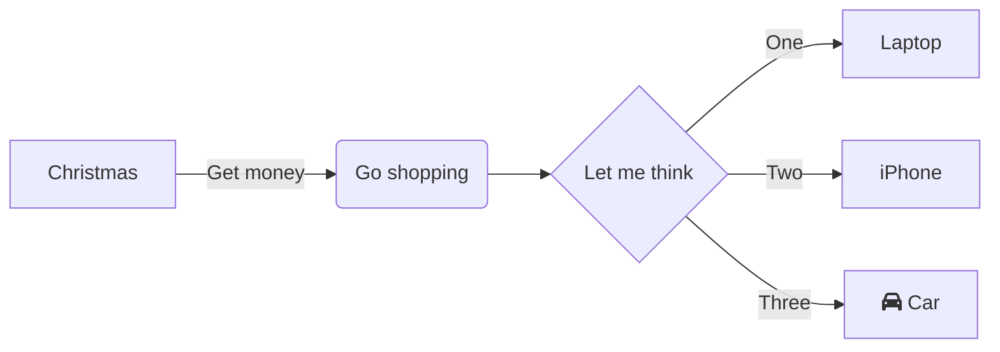

# The Ethereum Virtual Machine

This repository is intended to contain a full in depth explanation of the Ethereum Virtual Machine
and its execution environment for developers seeking lower level control than what is given in high
level languages.

This book is a work in progress and contributions in line with the
[contributing policy](CONTRIBUTING) are welcomed!

## Local Usage

To build this book locally, you will need `mdbook`.

Clone the repository:

```bash
git clone https://github.com/JoshuaTrujillo15/the-ethereum-virtual-machine/
```

Install [mdbook](https://lib.rs/crates/mdbook) - Rust crate for converting markdown to ebook :

```rust
cargo install mdbook
```

- If the above command throws an error it means you don't have the Rust compiler installed.
- Install [Rust](https://forge.rust-lang.org/infra/other-installation-methods.html)

_Install rust on Windows (WSL)_

```bash
 curl --proto '=https' --tlsv1.2 -sSf https://sh.rustup.rs | sh
```

_Install rust on Linux/MacOS_

```bash
curl https://sh.rustup.rs -sSf | sh -s -- --help
```

Enter this directory:

```bash
cd the-ethereum-virtual-machine
```

Start an `mdbook` server and automatically open the book in a browser.

```
mdbook serve --open
```

## MDBOOK Addons

This `mdbook` has two addons with the following functions

### `mdbook-mermaid` - Mermaid Diagrams support

````bash

1. [`mdbook-mermaid`](https://lib.rs/crates/mdbook-mermaid) - This addon enables rendering of mermaid diagrams in markdown.Which means you can add diagrams in mermaid syntax in the book

Mermaid Example Syntax

Code
```bash
%% Example syntax taken from https://mermaid.live/
graph LR
    A[Christmas] -->|Get money| B(Go shopping)
    B --> C{Let me think}
    C -->|One| D[Laptop]
    C -->|Two| E[iPhone]
    C -->|Three| F[fa:fa-car Car]

````

The above code gets rendered into the following diagram



1. [Mermaid Live - Mermaid Playground](https://mermaid.live/) - You can test your diagrams here.
2. [Github Markdown renders Mermaid](https://github.blog/2022-02-14-include-diagrams-markdown-files-mermaid/) - Official Github blog post on Mermaid.
3. [Mermaid Official Page](https://mermaid-js.github.io/mermaid/#/) - Official Mermaid page, for learning syntax

### `mdbook-admonish` -
